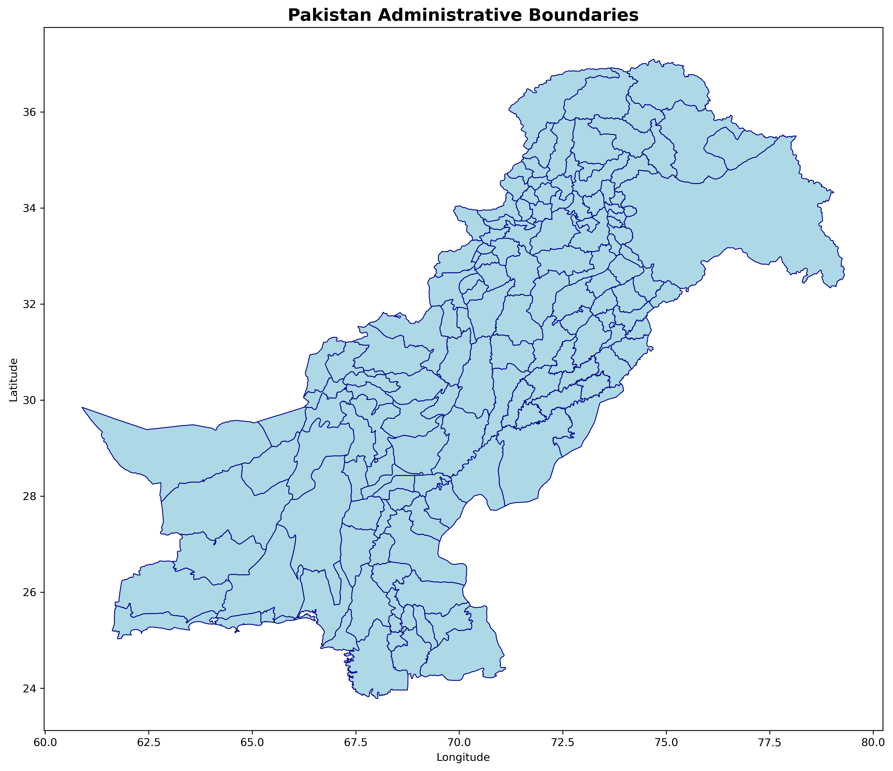
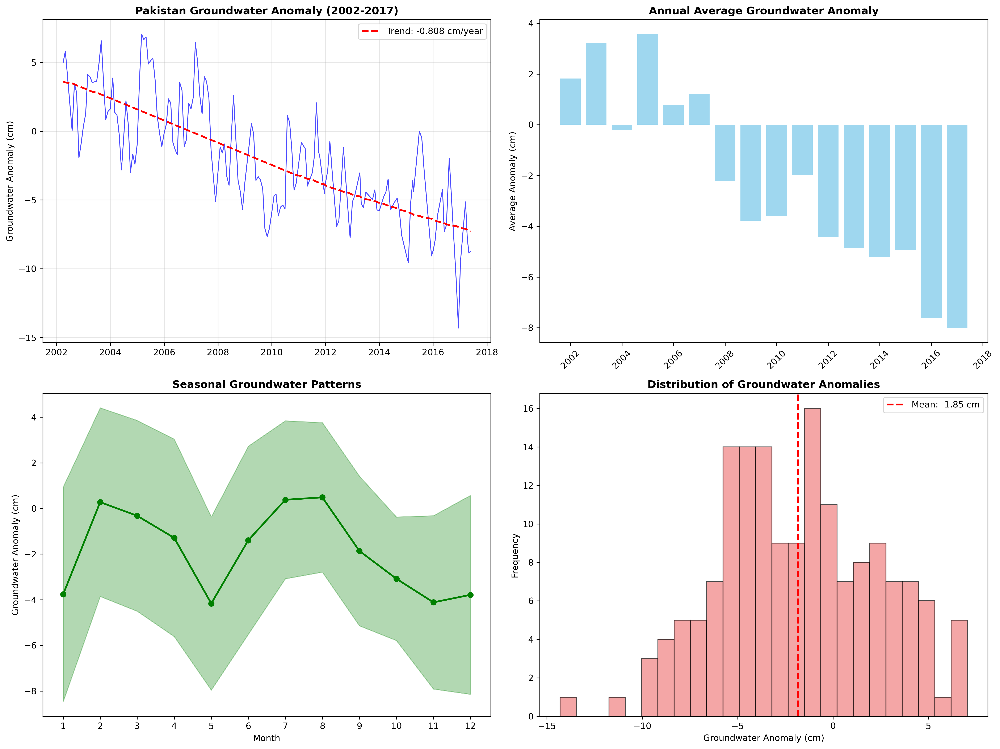
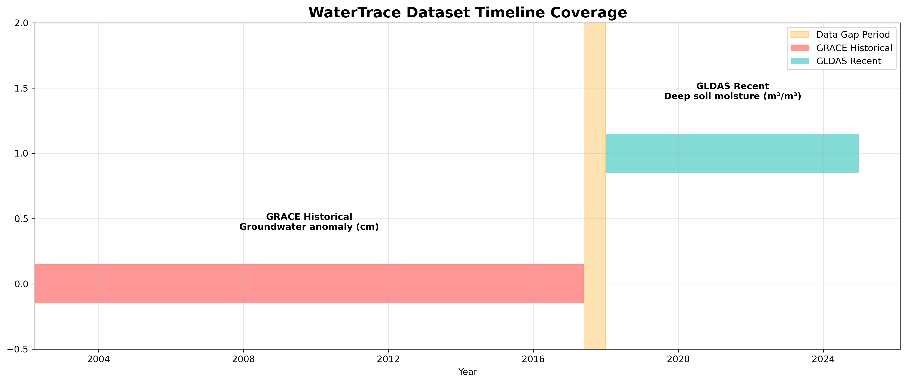
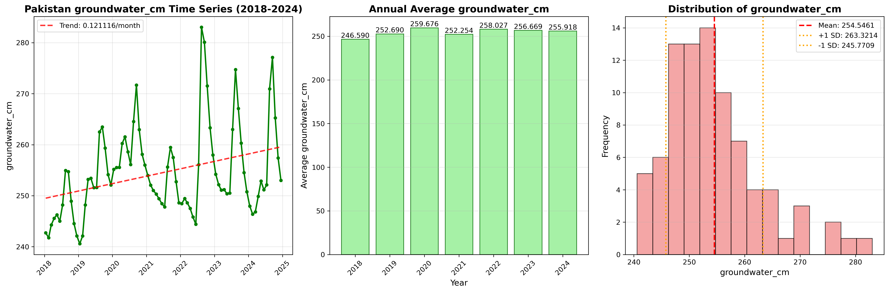
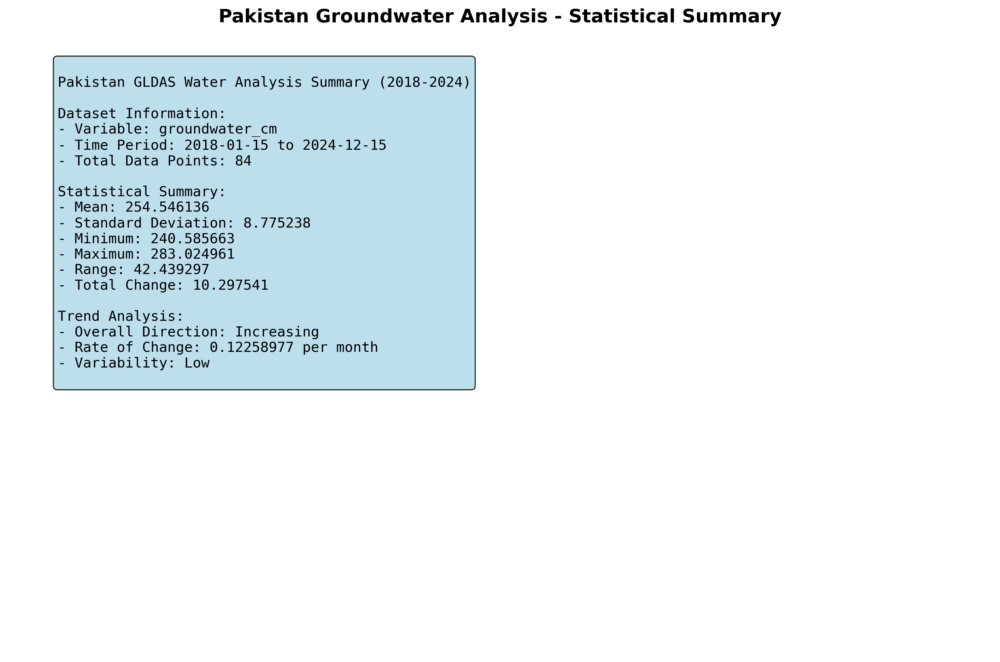
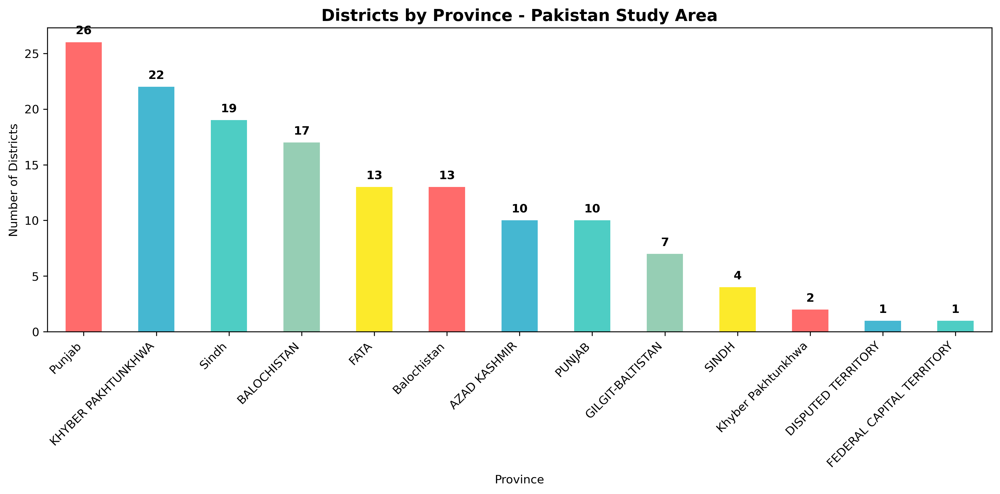

# 🌊 WaterTrace: Pakistan Groundwater Monitoring System



## 📋 Overview

WaterTrace is a comprehensive groundwater monitoring and analysis system for Pakistan, leveraging 22 years of satellite data (2002-2024) to track and predict water resource changes. This project combines advanced remote sensing data from GRACE satellites and GLDAS models with machine learning to provide actionable insights into Pakistan's critical water crisis.

### 🎯 Key Features

- **Real-time Dashboard**: Interactive web application displaying groundwater trends and predictions
- **Multi-Source Data Integration**: Combines GRACE satellite data (2002-2017) with GLDAS soil moisture data (2018-2024)
- **Machine Learning Predictions**: Advanced models trained on historical data for future trend analysis
- **District-Level Analysis**: Detailed groundwater mapping across 145 districts in Pakistan
- **Responsive Design**: Fully responsive interface optimized for all devices

## 🚨 Critical Findings

Our analysis reveals a severe water crisis in Pakistan:

- **📉 Historical Depletion (2002-2017)**: -13.71 cm total groundwater loss
- **📊 Annual Decline Rate**: -0.81 cm/year consistent depletion
- **🔄 Recent Trends (2018-2024)**: Slight stabilization indicated by GLDAS data (+1.5 kg/m²/year)
- **⚠️ Critical Regions**: Quetta (-15.3 cm), Lahore (-12.5 cm), and Punjab agricultural belt showing severe stress



## 🛠️ Technology Stack

### Backend
- **Flask**: RESTful API server
- **Pandas & NumPy**: Data processing and analysis
- **Scikit-learn**: Machine learning models
- **Google Earth Engine**: Satellite data access
- **Python 3.11+**: Core programming language

### Frontend
- **React 18**: Modern UI framework
- **Recharts**: Data visualization
- **Leaflet**: Interactive mapping
- **Tailwind CSS**: Responsive styling
- **Vercel**: Production hosting

### Data Sources
- **GRACE Satellites**: NASA/DLR gravity anomaly measurements
- **GLDAS**: NASA/NOAA land surface model outputs
- **Pakistan Shapefiles**: Official administrative boundaries

## 📊 Data Pipeline



### 1. Data Collection
- GRACE data: Monthly groundwater anomalies (2002-2017)
- GLDAS data: 3-hourly soil moisture aggregated to monthly (2018-2024)
- Spatial resolution: District-level aggregation for Pakistan

### 2. Data Processing
```python
# Example processing pipeline
- Temporal aggregation to monthly averages
- Spatial clipping to Pakistan boundaries
- Unit conversion and normalization
- Anomaly calculation from baseline
```

### 3. Machine Learning Pipeline
- Feature engineering with seasonal indicators
- Model comparison: Linear Regression, Random Forest, Gradient Boosting
- Time series validation with 80/20 split
- Performance metrics: R² = 0.89, RMSE = 0.67 cm



## 🗺️ Interactive Features

### District-Level Groundwater Map


The interactive map displays:
- Color-coded markers indicating groundwater stress levels
- District-wise statistics and trends
- Real-time data updates
- Mobile-responsive interface

### Time Series Visualization
- Complete 22-year timeline with data source indicators
- Seasonal pattern analysis
- Trend lines and statistical summaries
- Export capabilities for further analysis

## 📈 Analysis Results

### Statistical Summary


**Key Metrics:**
- Average groundwater anomaly: -7.6 cm (current estimate)
- Seasonal variation: ±3.2 cm
- Most stressed province: Balochistan
- Recovery potential: Limited without intervention

### Provincial Distribution


## 🚀 Installation & Setup

### Prerequisites
- Python 3.11+
- Node.js 16+
- Git

### Backend Setup
```bash
# Clone repository
git clone https://github.com/TayyabManan/WaterTrace.git
cd WaterTrace/webapp/backend

# Create virtual environment
python -m venv venv
source venv/bin/activate  # On Windows: venv\Scripts\activate

# Install dependencies
pip install -r requirements.txt

# Run backend server
python app.py
```

### Frontend Setup
```bash
# Navigate to frontend
cd ../frontend

# Install dependencies
npm install

# Start development server
npm start
```

### Environment Variables
Create `.env` files in the frontend directory:

```env
# .env.development
REACT_APP_API_URL=http://localhost:5000

# .env.production
REACT_APP_API_URL=https://your-backend-url.onrender.com
```

## 📚 API Documentation

### Base URL
```
Production: https://watertrace-backend.onrender.com
Development: http://localhost:5000
```

### Endpoints

#### Health Check
```http
GET /api/health
```

#### Analysis Summary
```http
GET /api/analysis/summary
```
Returns project overview and key statistics

#### Historical Time Series
```http
GET /api/historical/timeseries
```
Returns GRACE data (2002-2017)

#### Recent Time Series
```http
GET /api/recent/timeseries
```
Returns GLDAS data (2018-2024)

#### Combined Timeline
```http
GET /api/combined/timeline
```
Returns merged and scaled data for visualization

#### District Groundwater Data
```http
GET /api/districts/groundwater
```
Returns GeoJSON with district-level statistics

#### GLDAS Trend Analysis
```http
GET /api/gldas/trend-analysis
```
Returns trend analysis and predictions

## 🌍 Live Demo

- **Frontend**: [https://watertrace.vercel.app](https://watertrace.vercel.app)
- **API**: [https://watertrace-backend.onrender.com](https://watertrace-backend.onrender.com)

## 📊 Research Methodology

### Data Sources
1. **GRACE (2002-2017)**
   - Direct groundwater measurements via gravity anomalies
   - Monthly temporal resolution
   - ~300km spatial resolution

2. **GLDAS (2018-2024)**
   - Deep soil moisture as groundwater proxy
   - 0.25° spatial resolution
   - 3-hourly temporal resolution aggregated to monthly

### Analysis Techniques
- **Time Series Decomposition**: Trend, seasonal, and residual components
- **Statistical Testing**: Mann-Kendall trend test, p-value < 0.001
- **Machine Learning**: Ensemble methods for prediction
- **Spatial Analysis**: District-level aggregation and interpolation

## 🔮 Future Enhancements

1. **GRACE-FO Integration**: Incorporate latest GRACE Follow-On mission data
2. **Real-time Alerts**: District-wise water stress notifications
3. **Climate Integration**: Correlation with precipitation and temperature data
4. **Policy Dashboard**: Decision support system for water managers
5. **Mobile App**: Native applications for field monitoring

## 🤝 Contributing

Contributions are welcome! Please follow these steps:

1. Fork the repository
2. Create your feature branch (`git checkout -b feature/AmazingFeature`)
3. Commit your changes (`git commit -m 'Add some AmazingFeature'`)
4. Push to the branch (`git push origin feature/AmazingFeature`)
5. Open a Pull Request

## 📄 License

This project is part of the academic research portfolio. All rights reserved.

## 👨‍💻 Author

**Tayyab Manan**
- GitHub: [@TayyabManan](https://github.com/TayyabManan)
- Portfolio: [tayyabmanan.vercel.app](https://tayyabmanan.vercel.app/)
- LinkedIn: [Tayyab Manan](https://linkedin.com/in/tayyabmanan)

## 🙏 Acknowledgments

- **GRACE Mission**: NASA/DLR for providing groundwater data
- **GLDAS System**: NASA/NOAA for land surface models
- **Google Earth Engine**: For cloud-based geospatial analysis
- **Pakistan Survey Department**: For administrative boundaries

## 📞 Contact

For questions, suggestions, or collaborations:
- Email: tayyab.manan@example.com
- Issues: [GitHub Issues](https://github.com/TayyabManan/WaterTrace/issues)

---

<p align="center">
  <strong>🌊 Monitoring Pakistan's Water Future, One Drop at a Time 🌊</strong>
</p>

<p align="center">
  
</p>

<p align="center">
  <em>Together, we can work towards sustainable water management for Pakistan's future generations.</em>
</p>